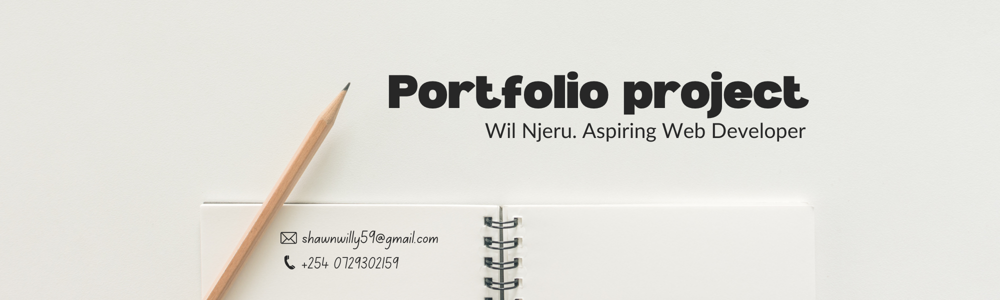

# Capstone project-1
# 📄 Semantic Resume Portfolio
My first Capstone Project for Web Development: A professional resume built exclusively with HTML.

## 🎯 Project Goal
The objective was to demonstrate a deep understanding of **HTML5 semantics** and document structure. By intentionally omitting CSS and JavaScript, this project focuses on content hierarchy, accessibility, and the core building blocks of the web.

## 🚀 Features
- **Semantic Structure:** Uses `<header>`, `<main>`, `<footer>`, and `<section>` for SEO and screen readers.
- **Content Organization:** Implementation of ordered and unordered lists for skills and experience.
- **Navigation:** Internal page linking to jump between sections.
- **Media:** Integration of profile images and contact icons.
- **Validated Code:** Clean, standard-compliant HTML5.

## 🛠 Tech Stack
- **HTML5**: 100% (No CSS/JS)

## 📸 Preview
> [!NOTE]
> Since this project uses no CSS, the layout is the browser's default "User Agent" style. This is intentional to showcase structural integrity!

## 🏁 How to Run
1. Clone the repository:
   ```bash
   git clone https://github.com
2. Open index.html in any modern web browser.
   
## 💡 What I Learned
- The importance of Heading levels (H1-H6) for accessibility.
- Building a foundation that is ready for future CSS styling.

Created as part of my Web Development Journey.
